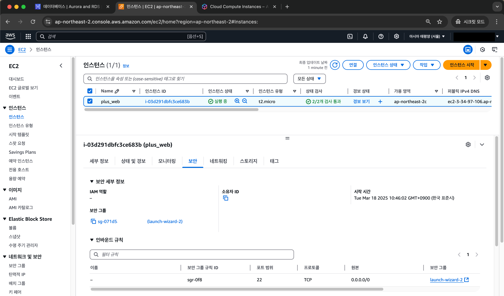
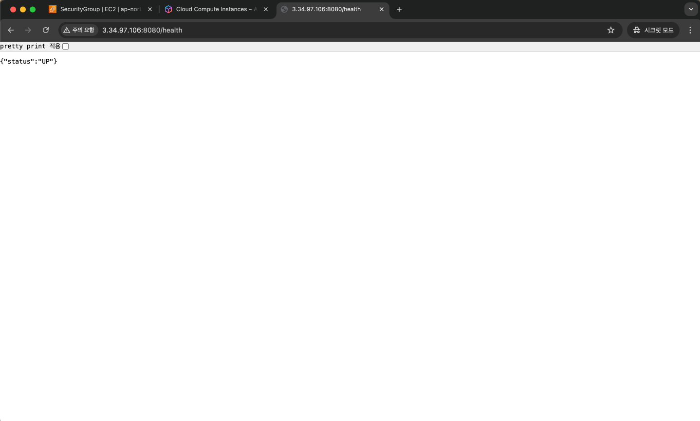
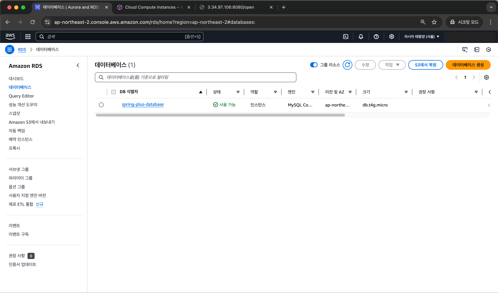
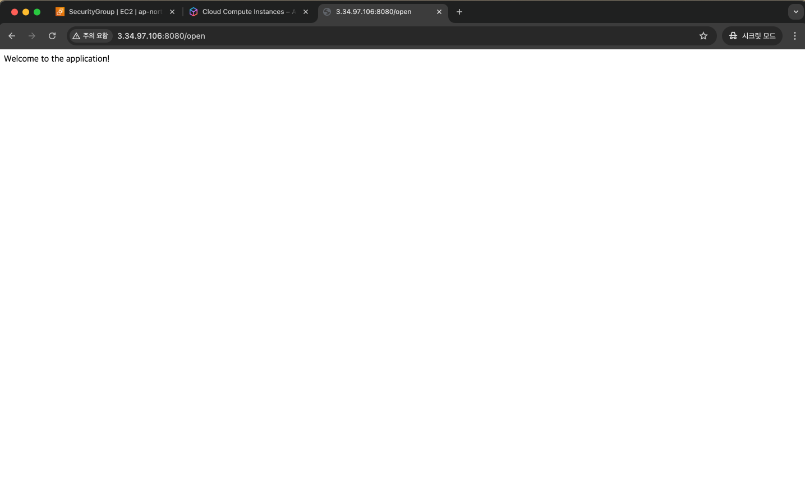
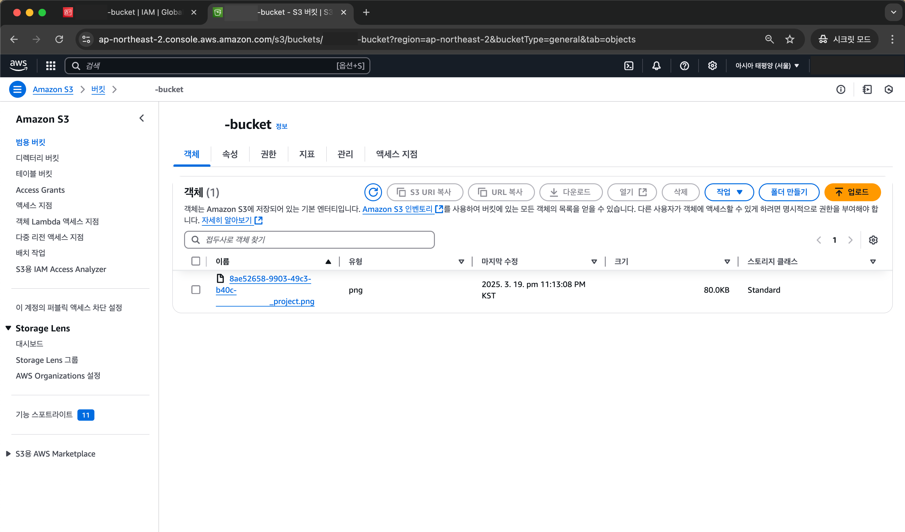
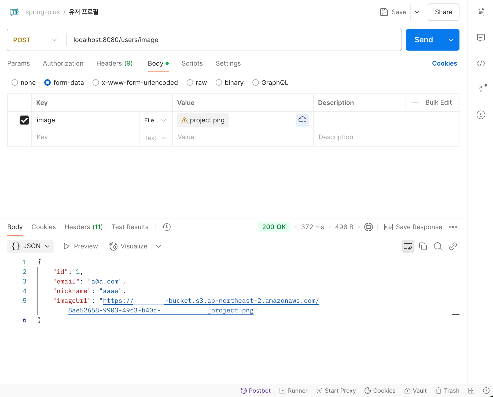
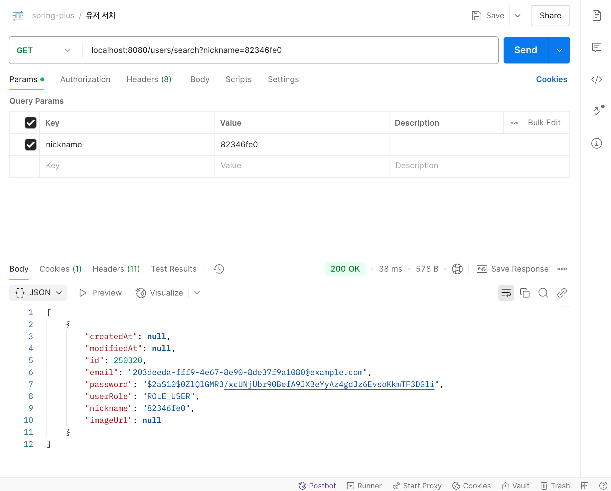
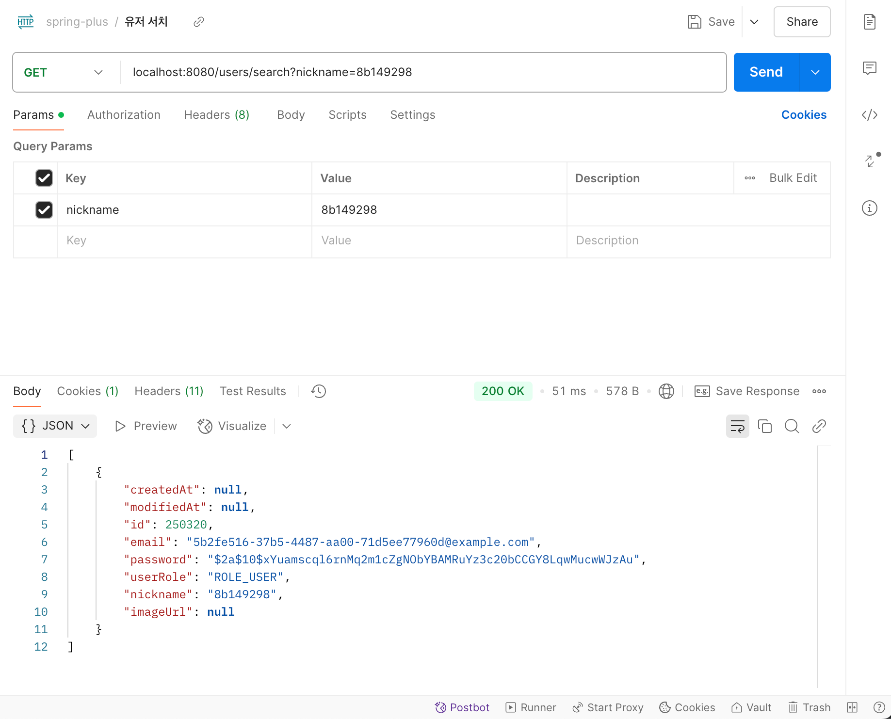

# SPRING PLUS

## Lv.1

## Lv.2

## Lv.3
### 12-1. EC2
- EC2 instance
<figure style="width: 750px" class="align-left">
  
</figure> 

- health check API
<figure style="width: 750px" class="align-left">
  
</figure> 

### 12-2. RDS
- RDS
<figure style="width: 750px" class="align-left">
  
</figure> 

- application
<figure style="width: 750px" class="align-left">
  
</figure> 

### 12-3. S3
- S3 bucket
<figure style="width: 750px" class="align-left">
  
</figure> 

- profile
<figure style="width: 750px" class="align-left">
  
</figure> 

### 13. 대용량 데이터 처리
- 최초 조회 속도
<figure style="width: 750px" class="align-left">
  
</figure> 

- 개선 1: 인덱스 적용
<figure style="width: 750px" class="align-left">
  
</figure> 

- 개선 2: Spring Boot 내장 캐싱 이용
<figure style="width: 750px" class="align-left">
  
</figure> 

<figure style="width: 750px" class="align-left">
  
</figure> 

